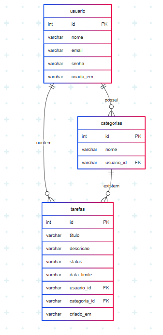

# 1. Introdução 

*Gerenciador de Tarefas* * é uma aplicação web moderna desenvolvida para otimizar o controle e a organização de tarefas do dia a dia. A plataforma permite que os usuários realizem operações completas de gerenciamento de tarefas, incluindo criação, visualização, edição, exclusão e atualização de status (pendente ou concluído).

A aplicação conta com um sistema de autenticação de usuários seguro e persistência de dados integrada, utilizando o Supabase como backend-as-a-service. Isso garante que as informações sejam armazenadas de forma confiável e estejam sempre disponíveis.

O projeto foi desenvolvido com tecnologias web atuais, adotando uma arquitetura separada entre frontend e backend. Essa abordagem facilita a manutenção, promove a escalabilidade e permite uma integração eficiente entre os serviços de autenticação e banco de dados.

##  Funcionalidades

- *CRUD de Tarefas:* Permite criar, ler, atualizar e excluir tarefas.
- *Gerenciamento de Status:* Possibilidade de marcar tarefas como concluídas ou pendentes.
- *Filtro por Status:* Filtragem de tarefas com base no seu estado atual.
- *Autenticação de Usuário:* Sistema de login e registro utilizando o serviço Supabase Auth.

##  Tecnologias Utilizadas

- *Frontend:* HTML, CSS, JavaScript puro.
- *Backend:* Node.js com Express.
- *Banco de Dados:* PostgreSQL, acessado através da plataforma [Supabase](https://supabase.io).
- *Serviços de Backend:* Supabase Auth (autenticação) e Supabase DB (persistência de dados).

# 2. Banco de Dados

O sistema utiliza o *PostgreSQL* como banco de dados relacional, gerenciado e hospedado pela plataforma [Supabase](https://supabase.io). O banco de dados é responsável por armazenar todas as informações relacionadas às tarefas e aos usuários autenticados, garantindo persistência e integridade dos dados.

A estrutura de dados foi projetada de forma simples e eficiente para atender às funcionalidades essenciais do sistema de gerenciamento de tarefas, permitindo operações de leitura e escrita com desempenho e segurança.

As principais tabelas utilizadas no projeto são:

## Estrutura de Dados

A seguir, estão descritas as principais tabelas utilizadas na aplicação:

- **usuarios**:  
  Gerenciada automaticamente pelo Supabase Auth. Contém os dados de autenticação dos usuários, como e-mail e um identificador único (ID).

- **categorias**:  
  Representa os projetos cadastrados pelos usuários. Cada registro armazena o título, a descrição, o status (concluído ou pendente) e o ID do usuário ao qual o projeto está vinculado.

- **tarefas**:  
  Contém as informações de cada tarefa cadastrada. Os campos incluem:
  - Título  
  - Descrição  
  - Data e horário de vencimento  
  - Opção de notificação próxima ao vencimento  
  - Nível de importância (ranking)  
  - Status (concluída ou pendente)  
  - ID do usuário associado  
  - ID do projeto (caso a tarefa esteja vinculada a uma categoria)
 

A integração com o banco de dados é realizada por meio de consultas SQL utilizando o Supabase Client no backend em Node.js. Essa abordagem garante um acesso seguro, eficiente e controlado aos dados da aplicação.

A seguir, apresenta-se o modelo lógico do banco de dados utilizado:

  

##  Alterações Recentes

Foi implementado um processo completo de **configuração, migração e testes da base de dados**, visando garantir robustez e reprodutibilidade do ambiente da aplicação. As principais melhorias incluem:

- **Integração com PostgreSQL via Supabase** com variáveis de ambiente parametrizadas no arquivo `.env`;
- **Script automatizado de migração (`runSQLScript.js`)**, responsável por estruturar o banco com tabelas e relacionamentos conforme o modelo lógico;
- **Implementação de testes automatizados com Jest e Supertest**, garantindo a cobertura das principais rotas (usuários, categorias, tarefas);
- **Arquivo `rest.http`** adicionado para facilitar testes manuais via VSCode ou ferramentas de requisição REST;
- Documentação complementar criada, detalhando o passo a passo para:  
  - Configurar o ambiente de banco de dados  
  - Executar as migrações  
  - Realizar testes das APIs  

Essas alterações fortalecem a confiabilidade e portabilidade do sistema, facilitando o onboarding de novos desenvolvedores e a continuidade evolutiva do projeto.
